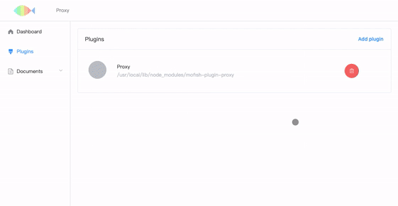

  
  
  
  
  
  

Mofish is a **proxy plugin** based on [Mofish](https://github.com/mofishteam/mofish) Development Platform.

Mofish-proxy has part of `Nginx` features, such as `proxy_pass`, `server_name` or `listen` settings, `location` checks. And other features like `Interceptor` (can be a Man-In-The-Middle to tamper the request or response), `Mock Server` (Make mock data for `location`(s)).

You can set several Servers and name it, close it.

> [中文介绍](./docs/CN/README.md)

## Overview

## Installation

You should install [Mofish](https://github.com/mofishteam/mofish) first. Run

> npm install mofish -g

Run `Mofish` platform

> mofish

Read the command line, remember the port num from command output `App is started at port 8xxx`, sometimes port 8080 has been in used, this plugin will add the port number until the port can be used.

You can also assign the port by using `-p` or `--port` param. For more detail, you can use `mofish -h`.

Install `mofish-plugin-proxy`

> npm install mofish-plugin-proxy -g

Add `mofish-plugin-proxy` to `Mofish` platform:

First, open https://localhost:8xxx (8xxx is the port you remembered before) in your browser.

Second,

Click `Add plugin` button, and Click `NPM` tab, find **`mosifh-plugin-proxy`** in `Installed Local` panel, click the green button right of words `mofish-plugin-proxy`, and you will see a new Tab at the top of the page. 

For more installation details of `Mofish` platform, please see [https://github.com/mofishteam/mofish](https://github.com/mofishteam/mofish)

## Contributions

Welcome to fork and pull requests, even edit a word in README.md.

## TODO

- [ ] Change to Electron based (Programing).
- [ ] Add feature - Transparent proxy.
- [ ] Modular Mock.

## Contact

Email: [x@anymelon.com](mailto:x@anymelon.com)

## Donations

If you think this plugin help you a lot, or only like the author, you can buy me a cup of JAVA.

## License

Mofish-Plugin-Proxy is available under the MIT license. See the LICENSE file for more info.
